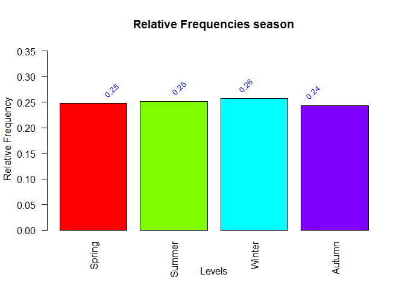

Weather Analysis and Prediction
================
Antoni Joan Bosch Rubio
2023-11-29

## EXERCICES

## Installing packages and loading libraries

``` r
# List of packages
packages <- c("doBy", "ggplot2", "dplyr", "car", "MASS", "lmtest", "caret", "psych", "corrplot", "RcmdrMisc")

# Function to check and install packages
check_and_install <- function(pkg){
  if (!require(pkg, character.only = TRUE)){
    install.packages(pkg, dependencies = TRUE)
    library(pkg, character.only = TRUE)
  }
}

# Apply the function to each package
sapply(packages, check_and_install)
```

    ## $doBy
    ## NULL
    ## 
    ## $ggplot2
    ## NULL
    ## 
    ## $dplyr
    ## NULL
    ## 
    ## $car
    ## NULL
    ## 
    ## $MASS
    ## NULL
    ## 
    ## $lmtest
    ## NULL
    ## 
    ## $caret
    ## NULL
    ## 
    ## $psych
    ## NULL
    ## 
    ## $corrplot
    ## NULL
    ## 
    ## $RcmdrMisc
    ## NULL

## Loading dataset

``` r
dataset <- readr::read_csv("day.csv")
head(dataset)
```

    ## # A tibble: 6 × 14
    ##   instant dteday     season    yr  mnth holiday weekday workingday weathersit
    ##     <dbl> <date>      <dbl> <dbl> <dbl>   <dbl>   <dbl>      <dbl>      <dbl>
    ## 1       1 2011-01-01      1     0     1       0       6          0          2
    ## 2       2 2011-01-02      1     0     1       0       0          0          2
    ## 3       3 2011-01-03      1     0     1       0       1          1          1
    ## 4       4 2011-01-04      1     0     1       0       2          1          1
    ## 5       5 2011-01-05      1     0     1       0       3          1          1
    ## 6       6 2011-01-06      1     0     1       0       4          1          1
    ## # ℹ 5 more variables: temp <dbl>, atemp <dbl>, hum <dbl>, windspeed <dbl>,
    ## #   cnt <dbl>

## Cleaning data

``` r
#Converting dataset to a dataframe
raw_data <- as.data.frame(dataset)
#Checking data info
str(raw_data)
```

    ## 'data.frame':    731 obs. of  14 variables:
    ##  $ instant   : num  1 2 3 4 5 6 7 8 9 10 ...
    ##  $ dteday    : Date, format: "2011-01-01" "2011-01-02" ...
    ##  $ season    : num  1 1 1 1 1 1 1 1 1 1 ...
    ##  $ yr        : num  0 0 0 0 0 0 0 0 0 0 ...
    ##  $ mnth      : num  1 1 1 1 1 1 1 1 1 1 ...
    ##  $ holiday   : num  0 0 0 0 0 0 0 0 0 0 ...
    ##  $ weekday   : num  6 0 1 2 3 4 5 6 0 1 ...
    ##  $ workingday: num  0 0 1 1 1 1 1 0 0 1 ...
    ##  $ weathersit: num  2 2 1 1 1 1 2 2 1 1 ...
    ##  $ temp      : num  0.344 0.363 0.196 0.2 0.227 ...
    ##  $ atemp     : num  0.364 0.354 0.189 0.212 0.229 ...
    ##  $ hum       : num  0.806 0.696 0.437 0.59 0.437 ...
    ##  $ windspeed : num  0.16 0.249 0.248 0.16 0.187 ...
    ##  $ cnt       : num  985 801 1349 1562 1600 ...

``` r
#Changing data type of qualitative features
qualitative_features <- c("season", "yr", "mnth", "holiday", "weekday", "workingday", "weathersit")
raw_data[qualitative_features] <- lapply(raw_data[qualitative_features], factor)

#Checking for missing data
sum(is.na(raw_data))
```

    ## [1] 0

``` r
#Checking for duplicated values
sum(duplicated(raw_data))
```

    ## [1] 0

``` r
#Converting "dtday" to Date format
raw_data$dteday <- as.Date(raw_data$dteday, format = "%Y-%m-%d")

#Substracting the 1st column (instant)
clean_data <- raw_data[,-1]

#Re-coding qualitative features
clean_data$season <- factor(clean_data$season, levels = c(1,2,3,4), labels = c("Spring", "Summer", "Winter", "Autumn"))
clean_data$yr <- factor(clean_data$yr, levels = c(0,1), labels = c("2011", "2012"))
clean_data$mnth <- factor(clean_data$mnth, levels = c(1,2,3,4,5,6,7,8,9,10,11,12), labels = c("January", "February", "March", "April","May","June","July","August","September","October","November","December"))
clean_data$holiday <- factor(clean_data$holiday, levels = c(0,1), labels = c("No", "Yes"))
#Weekday actually goes from 0 to 6 in the data(doesn't correspond with the feature's dictionary)
clean_data$weekday <- factor(clean_data$weekday, levels = c(0,1,2,3,4,5,6), labels = c("Monday", "Tuesday", "Wednesday", "Thursday","Friday","Saturday", "Sunday"))
clean_data$workingday<- factor(clean_data$workingday, levels = c(0,1), labels = c("No", "Yes"))
clean_data$weathersit <- factor(clean_data$weathersit, levels = c(1, 2, 3,4), labels = c("Sunny", "Cloudy", "Light R/S","Heavy R/S" ))
head(clean_data)
```

    ##       dteday season   yr    mnth holiday   weekday workingday weathersit
    ## 1 2011-01-01 Spring 2011 January      No    Sunday         No     Cloudy
    ## 2 2011-01-02 Spring 2011 January      No    Monday         No     Cloudy
    ## 3 2011-01-03 Spring 2011 January      No   Tuesday        Yes      Sunny
    ## 4 2011-01-04 Spring 2011 January      No Wednesday        Yes      Sunny
    ## 5 2011-01-05 Spring 2011 January      No  Thursday        Yes      Sunny
    ## 6 2011-01-06 Spring 2011 January      No    Friday        Yes      Sunny
    ##       temp    atemp      hum windspeed  cnt
    ## 1 0.344167 0.363625 0.805833 0.1604460  985
    ## 2 0.363478 0.353739 0.696087 0.2485390  801
    ## 3 0.196364 0.189405 0.437273 0.2483090 1349
    ## 4 0.200000 0.212122 0.590435 0.1602960 1562
    ## 5 0.226957 0.229270 0.436957 0.1869000 1600
    ## 6 0.204348 0.233209 0.518261 0.0895652 1606

### Descriptive analysis (through tabular and graphical representations) and excluding the record variable (instant}).

``` r
#Tabular descriptive analysis for numerical features
numeric_features <- c("temp", "atemp", "hum", "windspeed", "cnt")
numeric_descr <- as.data.frame(describe(clean_data[numeric_features]))
print(numeric_descr)
```

    ##           vars   n         mean           sd      median      trimmed
    ## temp         1 731    0.4953848 1.830510e-01    0.498333    0.4971884
    ## atemp        2 731    0.4743540 1.629612e-01    0.486733    0.4768516
    ## hum          3 731    0.6278941 1.424291e-01    0.626667    0.6271433
    ## windspeed    4 731    0.1904862 7.749787e-02    0.180975    0.1851337
    ## cnt          5 731 4504.3488372 1.937211e+03 4548.000000 4517.1897436
    ##                    mad        min         max        range        skew
    ## temp      2.347445e-01  0.0591304    0.861667    0.8025366 -0.05429742
    ## atemp     2.010761e-01  0.0790696    0.840896    0.7618264 -0.13055055
    ## hum       1.550562e-01  0.0000000    0.972500    0.9725000 -0.06949731
    ## windspeed 7.283866e-02  0.0223917    0.507463    0.4850713  0.67456815
    ## cnt       2.086018e+03 22.0000000 8714.000000 8692.0000000 -0.04715862
    ##             kurtosis           se
    ## temp      -1.1245642  0.006770386
    ## atemp     -0.9921068  0.006027337
    ## hum       -0.0802910  0.005267930
    ## windspeed  0.3906245  0.002866362
    ## cnt       -0.8205514 71.650353794

``` r
#Graphical descriptive analysis for numerical features

for (feature in numeric_features){
  data <- clean_data[,feature]
  ylim_values <- range(data)
  boxplot(data, xlab = feature, ylim = ylim_values)
}
```

<!-- --><!-- --><!-- --><!-- --><!-- -->

``` r
#Tabular descriptive analysis for qualitative features
qualit_descriptions <- list()

for (feature in qualitative_features) {
  df <- as.data.frame(table(clean_data[feature]))
  df$Relative_freq <- df$Freq / sum(df$Freq)
  
  qualit_descriptions[[feature]] <- df
}
print(qualit_descriptions)
```

    ## $season
    ##   season Freq Relative_freq
    ## 1 Spring  181     0.2476060
    ## 2 Summer  184     0.2517100
    ## 3 Winter  188     0.2571819
    ## 4 Autumn  178     0.2435021
    ## 
    ## $yr
    ##     yr Freq Relative_freq
    ## 1 2011  365      0.499316
    ## 2 2012  366      0.500684
    ## 
    ## $mnth
    ##         mnth Freq Relative_freq
    ## 1    January   62    0.08481532
    ## 2   February   57    0.07797538
    ## 3      March   62    0.08481532
    ## 4      April   60    0.08207934
    ## 5        May   62    0.08481532
    ## 6       June   60    0.08207934
    ## 7       July   62    0.08481532
    ## 8     August   62    0.08481532
    ## 9  September   60    0.08207934
    ## 10   October   62    0.08481532
    ## 11  November   60    0.08207934
    ## 12  December   62    0.08481532
    ## 
    ## $holiday
    ##   holiday Freq Relative_freq
    ## 1      No  710    0.97127223
    ## 2     Yes   21    0.02872777
    ## 
    ## $weekday
    ##     weekday Freq Relative_freq
    ## 1    Monday  105     0.1436389
    ## 2   Tuesday  105     0.1436389
    ## 3 Wednesday  104     0.1422709
    ## 4  Thursday  104     0.1422709
    ## 5    Friday  104     0.1422709
    ## 6  Saturday  104     0.1422709
    ## 7    Sunday  105     0.1436389
    ## 
    ## $workingday
    ##   workingday Freq Relative_freq
    ## 1         No  231     0.3160055
    ## 2        Yes  500     0.6839945
    ## 
    ## $weathersit
    ##   weathersit Freq Relative_freq
    ## 1      Sunny  463    0.63337893
    ## 2     Cloudy  247    0.33789330
    ## 3  Light R/S   21    0.02872777
    ## 4  Heavy R/S    0    0.00000000

``` r
#Graphical descriptive analysis of qualitative features
# Function to create plot per feature 
create_barplot <- function(feature, data) {
  # Get data from the current feature
  df <- data[[feature]]
  
  #Vector of bar colors
  colors <- rainbow(nrow(df))
  
  #Bar plot
  barplot(df$Relative_freq, 
          main = paste("Relative Frequencies", feature), 
          xlab = "Levels", 
          ylab = "Relative Frequency", 
          col = colors,
          names.arg = df[,1],  # Usar la primera columna para los nombres
          ylim = c(0, max(df$Relative_freq) + 0.1),  # Ajustar el rango del eje y para dar espacio a los textos
          las = 2)  # Rotar las etiquetas 45 grados
  
  # Bar labels
  text(x = seq_along(df$Relative_freq), 
       y = df$Relative_freq + 0.01,  # Ajustar la posición vertical del texto
       labels = sprintf("%.2f", df$Relative_freq), 
       pos = 3,  # Posición 3 coloca el texto arriba de la barra
       cex = 0.8, 
       col = "blue",
       srt = 45)
}

# Apply the function for each feature
for (feature in names(qualit_descriptions)) {
  create_barplot(feature, qualit_descriptions)
}
```

<!-- --><!-- --><!-- --><!-- --><!-- --><!-- --><!-- -->

``` r
#Tabular descriptive analysis for date feature
#Checking start and end of records
start_end_date <- data.frame(c((min(clean_data$dteday)), max(clean_data$dteday)), row.names = c("Start", "End"))
colnames(start_end_date) <- "Dates"
print(start_end_date)
```

    ##            Dates
    ## Start 2011-01-01
    ## End   2012-12-31

``` r
#Checking if there is only 1 record for each date recorded
duplicated_dates <-clean_data[duplicated(clean_data$dteday), ]
print(paste("Number of duplicated dates: ", nrow(duplicated_dates)))
```

    ## [1] "Number of duplicated dates:  0"

``` r
if(nrow(duplicated_dates) > 0) print(duplicated_dates)

#Checking if there is any gap in the time series
all_dates <- seq(from = start_end_date["Start", "Dates"], to = start_end_date["End", "Dates"], by = "day")
missing_dates <- setdiff(all_dates, clean_data$dteday)
print(paste("Number of missing dates: ", length(missing_dates)))
```

    ## [1] "Number of missing dates:  0"

### Bivariate analysis between the response variable (cnt) and the rest of the variables in the database except for the record variable (instant).

``` r
dateless_data <- clean_data[,-1]
#Bivariant analysis cnt vs qualitative features
#qualitative_features <- c("season", "yr", "mnth", "holiday", "weekday", "workingday", "weathersit")
qualitative_features <- c("season", "yr", "mnth", "holiday", "weekday", "workingday", "weathersit")
for (feature in qualitative_features){
  feature_cnt <- summaryBy(as.formula(paste("cnt ~", feature)), data = dateless_data, id = NULL, FUN = c(mean, min ,max, sd))
  assign(paste0(feature, "_cnt"), feature_cnt)
  print(feature_cnt)
}
```

    ##   season cnt.mean cnt.min cnt.max   cnt.sd
    ## 1 Spring 2604.133     431    7836 1399.942
    ## 2 Summer 4992.332     795    8362 1695.977
    ## 3 Winter 5644.303    1115    8714 1459.800
    ## 4 Autumn 4728.163      22    8555 1699.615
    ##     yr cnt.mean cnt.min cnt.max   cnt.sd
    ## 1 2011 3405.762     431    6043 1378.754
    ## 2 2012 5599.934      22    8714 1788.668
    ##         mnth cnt.mean cnt.min cnt.max   cnt.sd
    ## 1    January 2176.339     431    4521 1161.674
    ## 2   February 2655.298    1005    5062 1145.313
    ## 3      March 3692.258     605    8362 1899.302
    ## 4      April 4484.900     795    7460 1776.161
    ## 5        May 5349.774    2633    8294 1298.712
    ## 6       June 5772.367    3767    8120 1240.400
    ## 7       July 5563.677    3285    8173 1273.752
    ## 8     August 5664.419    1115    7865 1494.516
    ## 9  September 5766.517    1842    8714 1810.131
    ## 10   October 5199.226      22    8156 1988.393
    ## 11  November 4247.183    1495    6852 1285.713
    ## 12  December 3403.806     441    6606 1549.639
    ##   holiday cnt.mean cnt.min cnt.max   cnt.sd
    ## 1      No 4527.104      22    8714 1929.014
    ## 2     Yes 3735.000    1000    7403 2103.351
    ##     weekday cnt.mean cnt.min cnt.max   cnt.sd
    ## 1    Monday 4228.829     605    8227 1872.497
    ## 2   Tuesday 4338.124      22    7525 1793.074
    ## 3 Wednesday 4510.663     683    7767 1826.912
    ## 4  Thursday 4548.538     441    8173 2038.096
    ## 5    Friday 4667.260     431    7804 1939.433
    ## 6  Saturday 4690.288    1167    8362 1874.625
    ## 7    Sunday 4550.543     627    8714 2196.693
    ##   workingday cnt.mean cnt.min cnt.max   cnt.sd
    ## 1         No 4330.169     605    8714 2052.141
    ## 2        Yes 4584.820      22    8362 1878.416
    ##   weathersit cnt.mean cnt.min cnt.max   cnt.sd
    ## 1      Sunny 4876.786     431    8714 1879.484
    ## 2     Cloudy 4035.862     605    8362 1809.110
    ## 3  Light R/S 1803.286      22    4639 1240.284

``` r
#Bivariant analysis cnt vs numerical features
numeric_features2 <-  numeric_features[-5]
for (feature in numeric_features2){
 scatterplot(as.formula(paste("cnt ~", feature)), data = clean_data)
}
```

<!-- --><!-- --><!-- --><!-- -->

``` r
#Correlation heatmap of features
cor_data <- clean_data[,numeric_features]
correlation_matrix <- cor(cor_data)
corrplot(correlation_matrix, method = 'color')
```

<!-- -->

### Dividing the sample into a training sample (70%) and a test sample (30%), previously using the set.seed(123) instruction. Carrying out a multiple regression model to predict the cnt variable including only the numerical variables related to weather conditions. Then we interpret its coefficients, as well as the overall utility of the model. Using only the training sample.

``` r
set.seed(123)
train_sample <- dateless_data %>% sample_frac(0.7)
test_sample <- dateless_data %>% anti_join(train_sample)
mult_reg_model <- lm(cnt ~ windspeed + hum + atemp + temp, data = train_sample)
summary(mult_reg_model)
```

    ## 
    ## Call:
    ## lm(formula = cnt ~ windspeed + hum + atemp + temp, data = train_sample)
    ## 
    ## Residuals:
    ##     Min      1Q  Median      3Q     Max 
    ## -4832.2 -1007.2  -165.1  1122.6  3488.4 
    ## 
    ## Coefficients:
    ##             Estimate Std. Error t value Pr(>|t|)    
    ## (Intercept)   3568.8      465.1   7.673 8.70e-14 ***
    ## windspeed    -4287.1      887.3  -4.832 1.80e-06 ***
    ## hum          -2978.5      457.5  -6.510 1.81e-10 ***
    ## atemp        14116.1     4953.4   2.850  0.00455 ** 
    ## temp         -6258.1     4395.8  -1.424  0.15516    
    ## ---
    ## Signif. codes:  0 '***' 0.001 '**' 0.01 '*' 0.05 '.' 0.1 ' ' 1
    ## 
    ## Residual standard error: 1420 on 507 degrees of freedom
    ## Multiple R-squared:  0.4436, Adjusted R-squared:  0.4392 
    ## F-statistic: 101.1 on 4 and 507 DF,  p-value: < 2.2e-16

``` r
avPlots(mult_reg_model)
```

<!-- -->

### Adding a categorical predictor  to the previous model, interpreting its coefficients, also interpreting its overall utility. We keep using only the training sample.

``` r
model2 <- lm (cnt ~ windspeed + hum + atemp + temp + weathersit, data = train_sample)
summary(model2)
```

    ## 
    ## Call:
    ## lm(formula = cnt ~ windspeed + hum + atemp + temp + weathersit, 
    ##     data = train_sample)
    ## 
    ## Residuals:
    ##     Min      1Q  Median      3Q     Max 
    ## -4227.1 -1027.1  -119.6  1080.0  3467.1 
    ## 
    ## Coefficients:
    ##                     Estimate Std. Error t value Pr(>|t|)    
    ## (Intercept)           3016.3      480.0   6.284 7.14e-10 ***
    ## windspeed            -3475.6      889.3  -3.908 0.000106 ***
    ## hum                  -1722.8      582.3  -2.958 0.003239 ** 
    ## atemp                10405.8     4935.3   2.108 0.035486 *  
    ## temp                 -3170.8     4371.1  -0.725 0.468542    
    ## weathersitCloudy      -270.6      162.6  -1.665 0.096609 .  
    ## weathersitLight R/S  -1835.4      399.0  -4.600 5.35e-06 ***
    ## ---
    ## Signif. codes:  0 '***' 0.001 '**' 0.01 '*' 0.05 '.' 0.1 ' ' 1
    ## 
    ## Residual standard error: 1394 on 505 degrees of freedom
    ## Multiple R-squared:  0.466,  Adjusted R-squared:  0.4597 
    ## F-statistic: 73.45 on 6 and 505 DF,  p-value: < 2.2e-16

``` r
avPlots(model2)
```

<!-- -->

``` r
anova(mult_reg_model, model2)
```

    ## Analysis of Variance Table
    ## 
    ## Model 1: cnt ~ windspeed + hum + atemp + temp
    ## Model 2: cnt ~ windspeed + hum + atemp + temp + weathersit
    ##   Res.Df       RSS Df Sum of Sq     F    Pr(>F)    
    ## 1    507 1.022e+09                                 
    ## 2    505 9.809e+08  2  41101128 10.58 3.153e-05 ***
    ## ---
    ## Signif. codes:  0 '***' 0.001 '**' 0.01 '*' 0.05 '.' 0.1 ' ' 1

### Adding the interaction term windspeed\*hum to the model from the previous section, interpreting the new coefficients and carrying out a global contrast associated with the resulting model. Using only the training sample.

``` r
model3 <- lm (cnt ~ windspeed + hum + atemp + temp + weathersit + windspeed*hum, data = train_sample)
summary(model3)
```

    ## 
    ## Call:
    ## lm(formula = cnt ~ windspeed + hum + atemp + temp + weathersit + 
    ##     windspeed * hum, data = train_sample)
    ## 
    ## Residuals:
    ##     Min      1Q  Median      3Q     Max 
    ## -4224.7 -1021.6  -127.7  1074.7  3473.2 
    ## 
    ## Coefficients:
    ##                     Estimate Std. Error t value Pr(>|t|)    
    ## (Intercept)           2507.7      815.1   3.077  0.00221 ** 
    ## windspeed            -1188.6     3092.5  -0.384  0.70087    
    ## hum                   -930.9     1179.4  -0.789  0.43034    
    ## atemp                10569.0     4941.8   2.139  0.03294 *  
    ## temp                 -3290.3     4375.6  -0.752  0.45241    
    ## weathersitCloudy      -272.7      162.6  -1.677  0.09425 .  
    ## weathersitLight R/S  -1789.2      403.6  -4.433 1.14e-05 ***
    ## windspeed:hum        -3800.6     4922.0  -0.772  0.44038    
    ## ---
    ## Signif. codes:  0 '***' 0.001 '**' 0.01 '*' 0.05 '.' 0.1 ' ' 1
    ## 
    ## Residual standard error: 1394 on 504 degrees of freedom
    ## Multiple R-squared:  0.4666, Adjusted R-squared:  0.4592 
    ## F-statistic: 62.99 on 7 and 504 DF,  p-value: < 2.2e-16

``` r
avPlots(model3)
```

<!-- -->

``` r
anova(model2, model3)
```

    ## Analysis of Variance Table
    ## 
    ## Model 1: cnt ~ windspeed + hum + atemp + temp + weathersit
    ## Model 2: cnt ~ windspeed + hum + atemp + temp + weathersit + windspeed * 
    ##     hum
    ##   Res.Df       RSS Df Sum of Sq      F Pr(>F)
    ## 1    505 980896638                           
    ## 2    504 979737587  1   1159051 0.5962 0.4404

### Applying the *backward elimination* method to reduce the level of complexity of the previous model. Using only the training sample.

``` r
model4 <- stepwise(model3, direction='backward', criterion='BIC', trace = 0) 
```

    ## 
    ## Direction:  backward
    ## Criterion:  BIC

``` r
summary(model4)
```

    ## 
    ## Call:
    ## lm(formula = cnt ~ windspeed + hum + atemp + weathersit, data = train_sample)
    ## 
    ## Residuals:
    ##     Min      1Q  Median      3Q     Max 
    ## -4054.9 -1055.8  -129.4  1063.0  3518.8 
    ## 
    ## Coefficients:
    ##                     Estimate Std. Error t value Pr(>|t|)    
    ## (Intercept)           3150.7      442.6   7.119 3.74e-12 ***
    ## windspeed            -3649.8      855.9  -4.264 2.39e-05 ***
    ## hum                  -1675.0      578.4  -2.896  0.00394 ** 
    ## atemp                 6837.1      392.3  17.427  < 2e-16 ***
    ## weathersitCloudy      -281.9      161.7  -1.743  0.08192 .  
    ## weathersitLight R/S  -1879.8      394.1  -4.770 2.41e-06 ***
    ## ---
    ## Signif. codes:  0 '***' 0.001 '**' 0.01 '*' 0.05 '.' 0.1 ' ' 1
    ## 
    ## Residual standard error: 1393 on 506 degrees of freedom
    ## Multiple R-squared:  0.4654, Adjusted R-squared:  0.4602 
    ## F-statistic: 88.12 on 5 and 506 DF,  p-value: < 2.2e-16

``` r
avPlots(model4)
```

<!-- -->

``` r
anova(model3,model4)
```

    ## Analysis of Variance Table
    ## 
    ## Model 1: cnt ~ windspeed + hum + atemp + temp + weathersit + windspeed * 
    ##     hum
    ## Model 2: cnt ~ windspeed + hum + atemp + weathersit
    ##   Res.Df       RSS Df Sum of Sq     F Pr(>F)
    ## 1    504 979737587                          
    ## 2    506 981918724 -2  -2181137 0.561  0.571

### Validating the theoretical assumptions of the linear model using statistical contrasts and graphs using the model obtained in the previous section and using only the training sample. Additionally, we will report some fit indicator for the test sample.

``` r
# Linearity
predicted <- predict(model4)
plot(train_sample$cnt, predicted)
abline(0,1)
```

<!-- -->

``` r
# We can see that the linearity assumption is fulfilled.
```

``` r
# Independence
durbinWatsonTest(model4)
```

    ##  lag Autocorrelation D-W Statistic p-value
    ##    1     -0.01956459      2.039054    0.69
    ##  Alternative hypothesis: rho != 0

``` r
# D-W Statistic of 2, there is no autocorrelation. A pvalue of .69 means that we cannot reject the null hypothesis of no autocorrelation. This means that our model meets the assumption of independence of errors.
```

``` r
# Homoscedasticity
plot(predicted, residuals(model4))
abline(h=0, lty = 2)
```

<!-- -->

``` r
# The curve is a straight line parallel to the X-axis, showing that there might be variations between the predicted and the residual value. This variation should be constant, following the assumption of homoscedasticity.
```

``` r
# Normality
qqnorm(residuals(model4))
qqline(residuals(model4))
```

<!-- -->

``` r
shapiro.test(residuals(model4))
```

    ## 
    ##  Shapiro-Wilk normality test
    ## 
    ## data:  residuals(model4)
    ## W = 0.98791, p-value = 0.0003038

``` r
# We can see that our pvalue is less than 0.05, providing enough evidence to reject the null-hypothesis, our residuals are not normally distributed. Also, our Q-Q plot confirms this, since the residuals are not completely falling on a straight line.
```

``` r
# Multicolinearity
vif_values <- vif(model4)
print(vif_values)
```

    ##                GVIF Df GVIF^(1/(2*Df))
    ## windspeed  1.183855  1        1.088051
    ## hum        1.804506  1        1.343319
    ## atemp      1.069618  1        1.034223
    ## weathersit 1.711415  2        1.143770

``` r
# There are no significant issues of multicolinearity
```

``` r
# Fit indicator
predictions_train <- model4 %>% predict(train_sample)
data.frame(R2 = R2(predictions_train, train_sample$cnt),
           RMSE = RMSE(predictions_train, train_sample$cnt),
           MAE = MAE(predictions_train, train_sample$cnt))
```

    ##          R2    RMSE      MAE
    ## 1 0.4654447 1384.85 1136.802

``` r
predictions <- model4 %>% predict(test_sample)
data.frame(R2 = R2(predictions, test_sample$cnt),
           RMSE = RMSE(predictions, test_sample$cnt),
           MAE = MAE(predictions, test_sample$cnt))
```

    ##          R2     RMSE      MAE
    ## 1 0.5178082 1422.496 1179.488

``` r
PER1<-RMSE(predictions_train, train_sample$cnt)/mean(train_sample$cnt)
cat("Prediction error rate train:", PER1)
```

    ## Prediction error rate train: 0.3060852

``` r
PER2<-RMSE(predictions, test_sample$cnt)/mean(test_sample$cnt)
cat("Prediction error rate test:", PER2)
```

    ## Prediction error rate test: 0.3191252

``` r
# Lower error rate in prediction for trained model.
# When chosing between 2 models, the one with lower RMSE for the test_sample(not trained) should be the prefered
```
